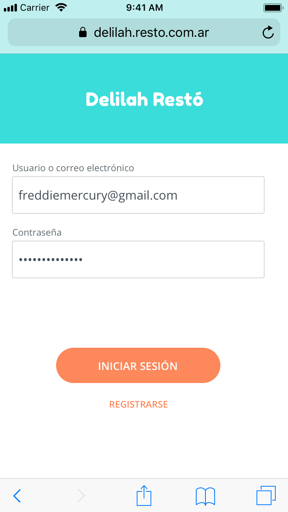
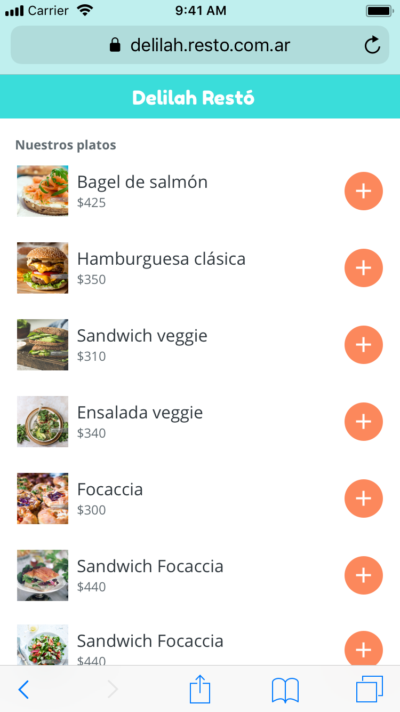
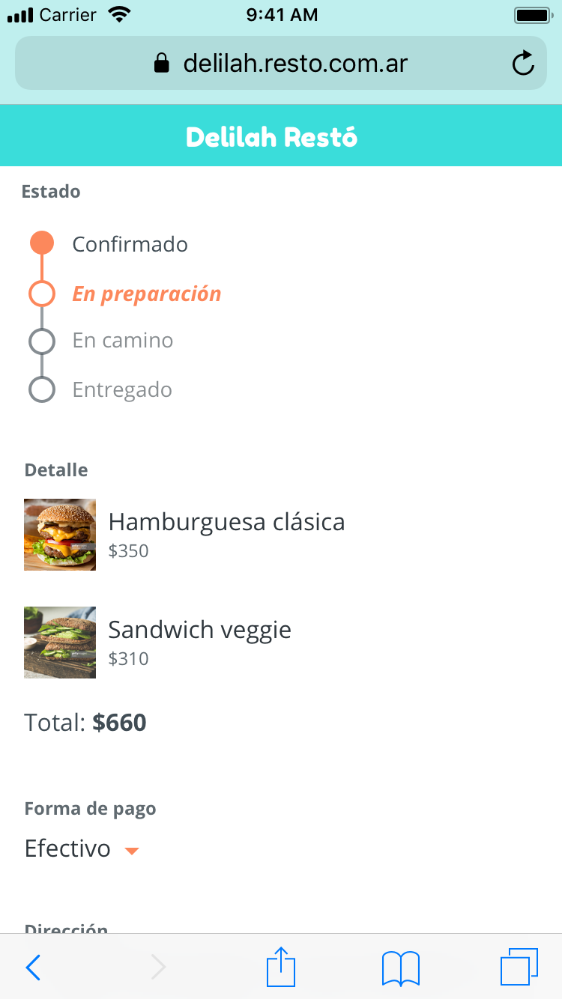
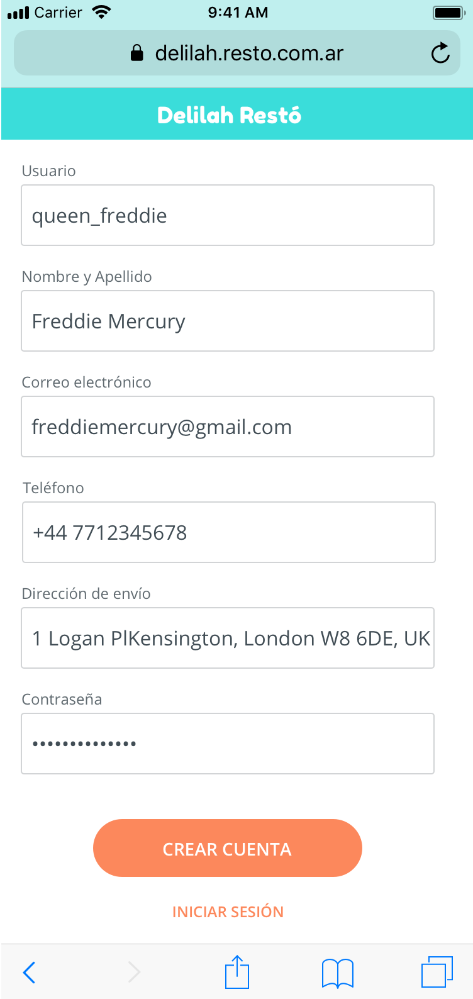
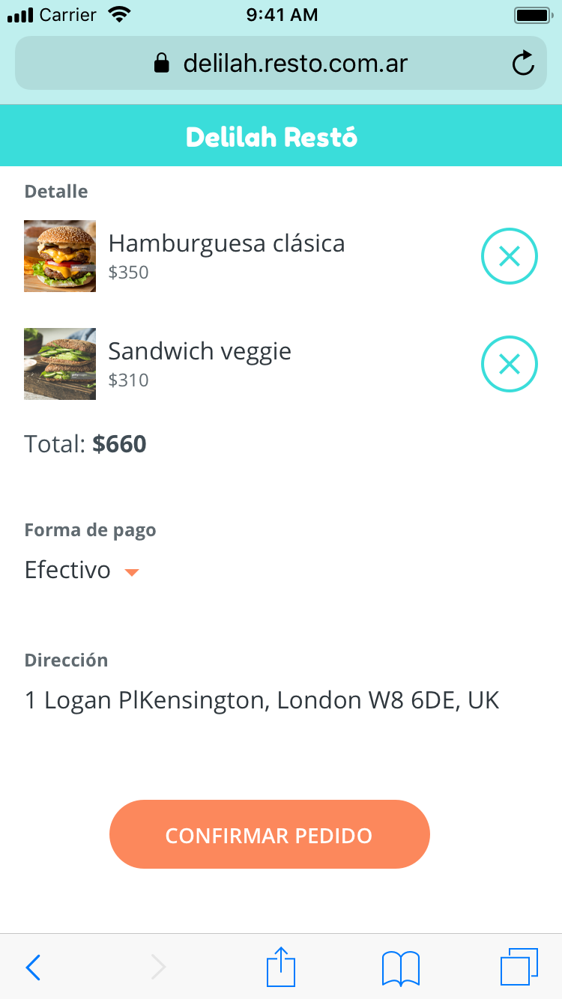
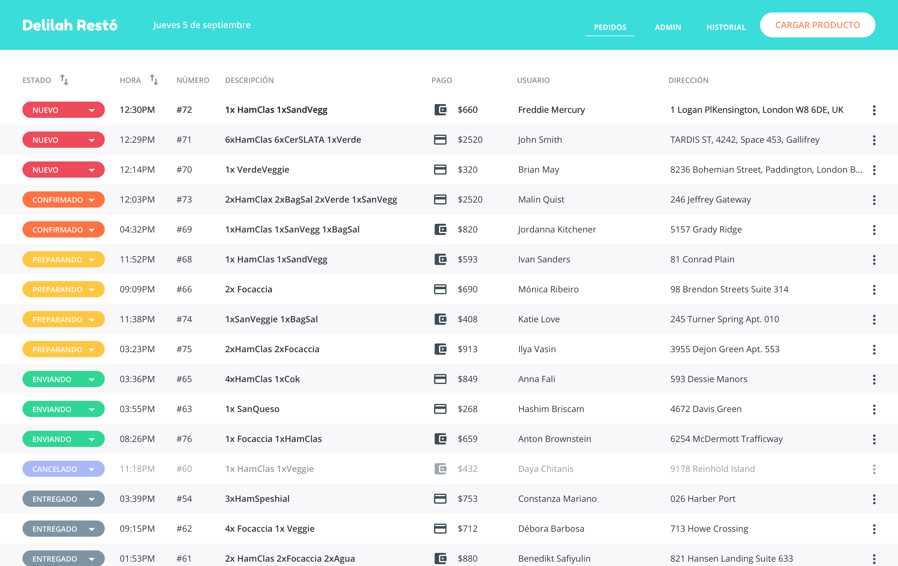
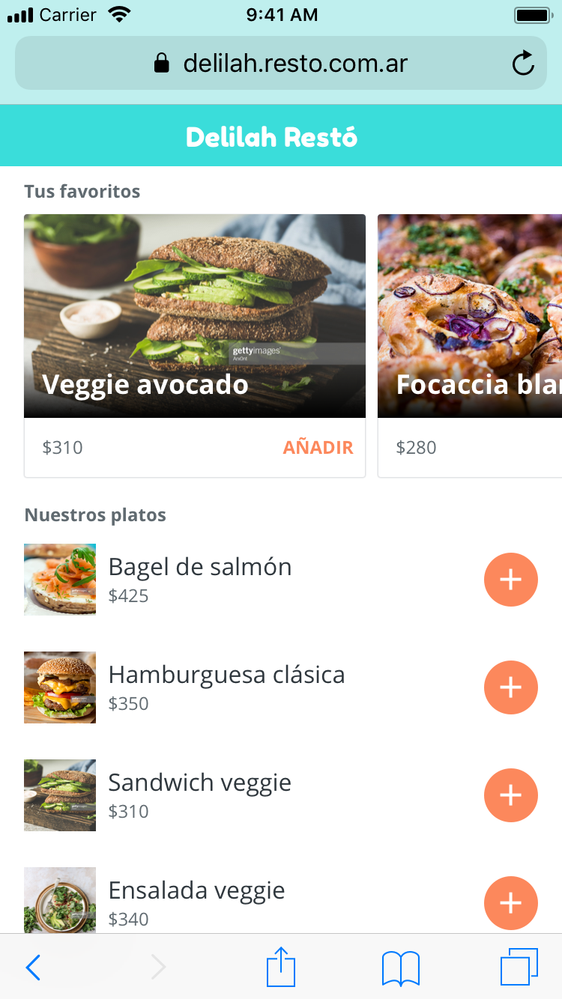
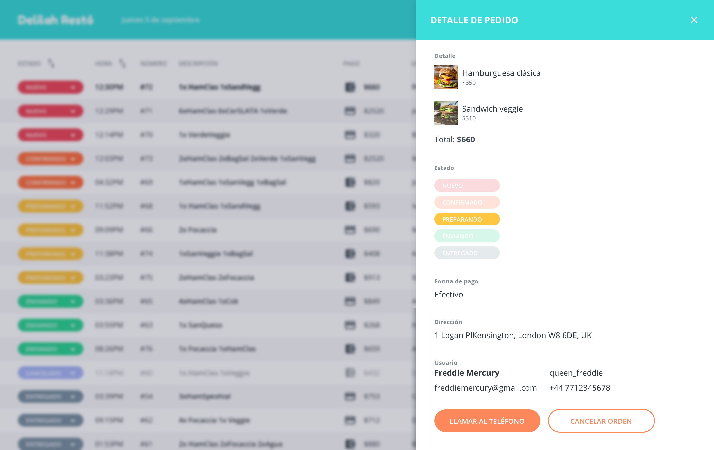

# delilah-resto
Under developing...

## Instalation
1. You'll need [nodejs](https://nodejs.org). Check you  already have it installed in your system by typing in your terminal
```bash
node --version
```
2. Clone repository, get into it and install its dependencies.
```bash
git clone https://github.com/wgnr/delilah-resto
cd delilah-resto
npm install
```
3. Start server. If you close terminal, server ends.
```bash
npm start
```

## Used Technologies
- [nodejs](https://nodejs.org) : Provide core server-side functionalities.
- [Postman](https://www.postman.com/) : Software used to try API requests.


## NPM Packages
- [Express](http://expressjs.com) : Provide an easy-way to handle request and managing routes.
- [joi](https://www.npmjs.com/package/@hapi/joi) : Object schema validation for incomming request body and params.
- [jsonwebtoken](https://www.npmjs.com/package/jsonwebtoken) : Creation and validation of [JWT](https://jwt.io) authorization method.
- [Sequelize](https://www.npmjs.com/package/sequelize) : ORM for MariaDB.
- [mysql2](https://www.npmjs.com/package/mysql2) : MySQL client for nodejs. Used to connect with MariaDB.
- [dotenv](https://www.npmjs.com/package/dotenv) : Used to protect the JWT passphrase. 


<!-- # Procedure
In the folder [design](./design/reference_img/) you will find all the images that compound the project.

Let's analyse one by one in order to identify the data structure and the differents API endpoints that we would have to use. -->

<!-- ### Log in








 -->